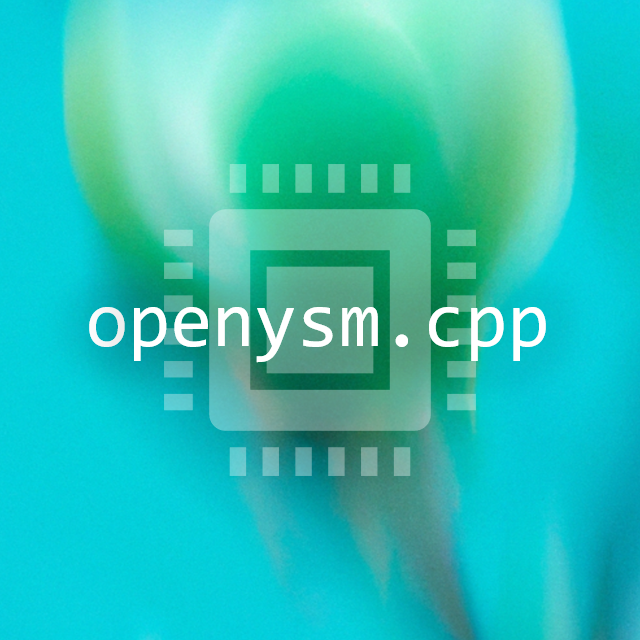

  
  <h1>openysm.cpp</h1>
  
C++实现的GPU、SIMD渲染器

## 源码真源约定（Source of truth）

**此目录 `.sources/openysm.cpp/` 是唯一被实际编译的 native 源。** 所有平台
（windows-x64/x86、linux-x64、macos-x64/arm64、android-arm64）的 `ysm-core.*` 二进制
都由此处的 `dllmain.cpp` + `build.zig` 用 zig 构建产出，再手工拷入各发布分支的
`resources/natives/`。

各发布分支下的 `common/src/main/native/openysm.cpp/`（Fa26.1.2、Fa26.2 等）是
**只读镜像**——它们不被 gradle 编译（`inputs.dir("src/main/native")` 仅用于缓存失效），
存在仅为保留工程结构。**修改 native 一律改本目录，再同步到各镜像。**

- 构建命令：`zig build -Dplatform=<name|all> -Drelease`（android 需 `-Dandroid-ndk=...`）
- 产物：`zig-out/<platform>/`
- 同步范围：`dllmain.cpp`、`build.zig`、`build.zig.zon`、`README.md`、`LICENSE`、`.gitignore`
  （`third_party/`、`images/` 已一致，无需同步）
- **禁止反向同步**（镜像 → 本目录）：会覆盖本目录的正确逻辑。
